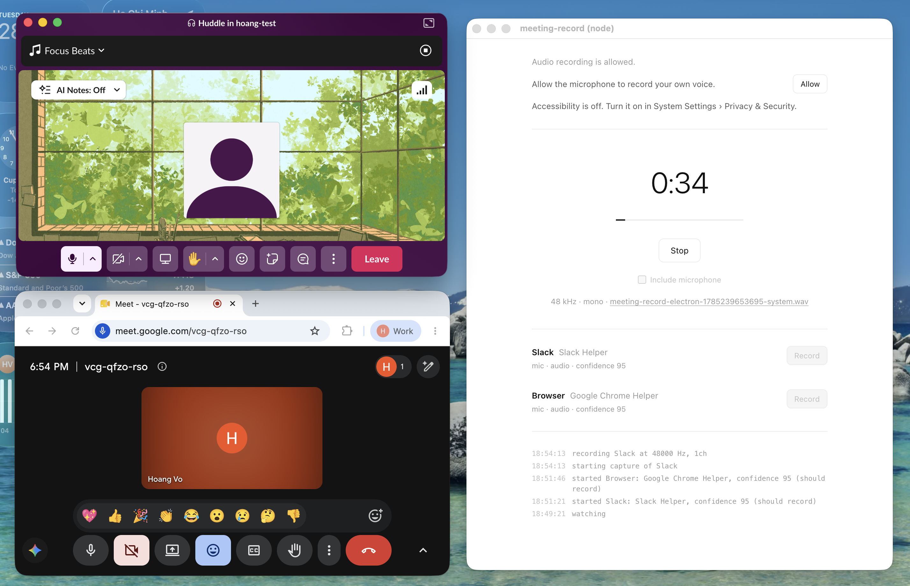

# meeting-record

System-audio and microphone capture with meeting detection for macOS and Windows.

## Packages

- [Node.js / TypeScript](./node/README.md)
- [Rust](./rust/README.md)

## Examples



Check out the example apps for [Tauri](./apps/tauri/README.md) (Rust binding) and [Electron](./apps/electron/README.md) (Node.js binding).

Need an AI Note-taker? Check out [fireflies.ai](https://fireflies.ai/?utm_source=github&utm_medium=referral&utm_campaign=hoangvvo_meeting-record).

## Platform support

| Platform | Minimum version | Architectures |
| -------- | --------------- | ------------- |
| macOS    | 14.2            | arm64, x86-64 |
| Windows  | 10 build 20348  | arm64, x86-64 |

On macOS, system-audio capture needs `NSAudioCaptureUsageDescription`. Add `NSMicrophoneUsageDescription` only when requesting the microphone track. The app must be signed and running as a GUI application for permission prompts.

```xml
<key>NSAudioCaptureUsageDescription</key>
<string>Records meeting audio so it can be transcribed.</string>
<key>NSMicrophoneUsageDescription</key>
<string>Records your voice so meetings can be transcribed.</string>
```

## Permissions

| Permission        | Purpose                                                  | Prompt type            |
| ----------------- | -------------------------------------------------------- | ---------------------- |
| **System Audio**  | Required to capture audio.                               | One-time modal dialog. |
| **Microphone**    | Required only when the microphone track is requested.    | One-time modal dialog. |
| **Accessibility** | Optional. Required only to read meeting titles and URLs. | System Settings.       |

Permission handling is asynchronous. Query the permission status for the result.

Microphone capture is opt-in. It uses the current default input device and stays separate from system audio; the library never mixes the two tracks together.

## Detection

The passive watcher reports meetings starting, changing, and ending on a safe serial queue.

| ID        | Name                         |
| --------- | ---------------------------- |
| `zoom`    | Zoom                         |
| `teams`   | Microsoft Teams              |
| `meet`    | Google Meet                  |
| `webex`   | Webex                        |
| `slack`   | Slack                        |
| `discord` | Discord                      |
| `browser` | Other browser-based meetings |

Always rely on `shouldRecord` / `should_record`. It becomes true when there is active two-way audio or remote audio; idle conferencing apps remain false.

## Capture

- **Process target:** Recommended. Captures the selected meeting process and its audio helpers.
- **System target:** Captures all application audio.

## Troubleshooting

- **Capture start times out:** The permission grant is undetermined. Request permissions from a bundled GUI app, not a bare CLI executable.
- **Capture runs but outputs zeroes:** The targeted processes may have exited.
- **Titles/URLs are empty:** Accessibility permission was not granted, or the app was not restarted after granting it.

## Development

### Lint and format

```sh
npm run lint:fix && npm run fmt
cargo +nightly clippy --all-targets --all-features --workspace && cargo +nightly fmt
```

### Testing

Run unit tests:

```sh
npm test
cargo test -p meeting-record --all-targets
```

Test E2E tests:

```sh
MREC_IDENTITY="$(security find-identity -v -p codesigning | awk '/Developer ID Application/ { print $2; exit }')" ./e2e/macos.sh
```

```powershell
./e2e/windows.ps1 -Mode All
```
